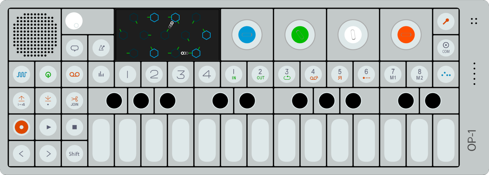

# WebGL OP-1

I attempt to design a model of Teenage Engineering's OP-1 in WebGL in order to
practice WebGL programming in a goal-driven way.



Image credit: https://en.wikipedia.org/wiki/File:OP-1_Sequencer_Concept.png

There is alsoa [related project](https://github.com/TomasHubelbauer/three-op-1)
which uses ThreeJS.

- Combine shading with colors (colored materials) and use in the OP-1 scene
- Figure out how to allow rotating using the mouse and scaling using the wheel
  https://www.tutorialspoint.com/webgl/webgl_interactive_cube.htm
- Make the top and bottom face edges round (makes the arc for vertical edges a
  bit more complex - 1/8 of a sphere in the actual corners)
- Model a keyboard key and draw a the keyboard in the OP-1 scene
- Render the OP-1 display graphic and the OP-1 label on the top face using a texture
  (Probably need to pass this information to the shared and go with color/UV depending)
- Adjust the recession location and size on the top face to match the keyboard
- Hook up WebMIDI and depress the OP-1 keys based on the MIDI keys sent in
- Model the standalone parts as separate meshes:
  - Case (recession for TE logo, screw holes, LED holes and mic holes, OP-1 text)
  - White key
  - Black keys
  - Control key
  - Encoder
  - Display
  - Volume knob
  - Speaker
  - Stand
  - I/O cover
  - PCB (for exploded view)

- Improve the Droste demo based on https://stackoverflow.com/q/56841018/2715716
- Create a scene with a WebGL portal in it (does WebGL support non-Euclidean?)
- Render the OP-1 text on the side of the keyboard
  - https://stackoverflow.com/a/35027166/2715716
  - https://delphic.me.uk/tutorials/webgl-text
  - https://webglfundamentals.org/webgl/lessons/webgl-text-canvas2d.html
  - https://webglfundamentals.org/webgl/lessons/webgl-text-glyphs.html
  - Consider the fact this this is a short, static text and might be better as
    just a plain texture
- Figure out what to do next based on how it went so far
- Consider using WebMIDI the other way too - play a note when pressing a key on
  the model
  - Not sure if the OP-1 can receive MIDI as input so that the note would play
    through it and not the browser, but the keyboard might be able to do this
- Replace the matrix libray with in-tree routines to keep the thing flat and
  straightforward to read and understand
- Find out what `vertexAttribPointer`'s `normalize` argument is for (clamping?)
- Consider designing (some of) the internals as well so that I could make an
  exploded view of the device

---

```js
const context = document.createElement('canvas').getContext('webgl');
context.getParameter(context.MAX_TEXTURE_IMAGE_UNITS);
```

| Browser | Max Texture Image Units |
|-|-|
| Firefox | 16 |
| Chrome | 16 |
| Edge | 16 |
| Safari | 16 |

---

The default WebGL depth testing function is `LESS`.

---

WebGL only seems to be able to draw points, lines and tris, not quads
(without triangulation).
